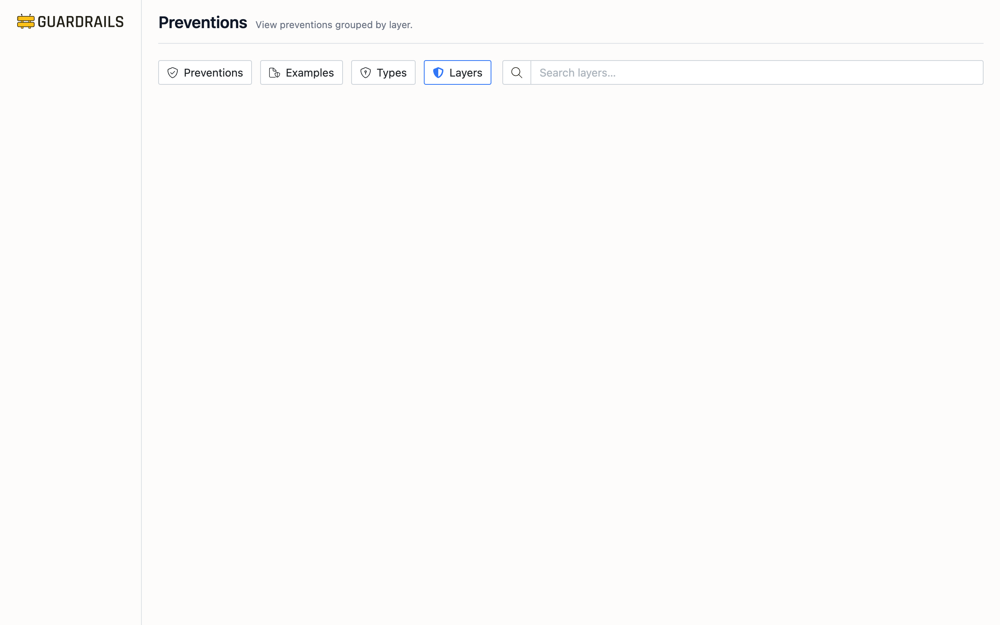

# Prevention Layers

Preventions operate at different points in time—some catch problems in your Infrastructure as Code before deployment, others block dangerous API calls, some enforce settings on existing resources, and others respond to threats in real-time. This view organizes your preventions by when they operate, helping you identify whether you have defense-in-depth or are relying too heavily on one approach.

## Why Layers Matter

The layer matters because it affects both when problems are caught and how difficult they are to bypass. A Terraform policy that rejects templates defining public S3 buckets (Build layer) catches the issue before anything reaches AWS. An SCP that denies MakeBucketPublic API calls (Access layer) stops the action even if someone tries it manually in the console. An S3 Block Public Access account setting (Config layer) enforces the rule on all buckets regardless of how they were created. A Guardrails control that remediates public buckets (Runtime layer) fixes the problem after it happens.

Defense-in-depth means having controls at multiple layers. If your Build layer policies don't catch something (maybe it was created manually), your Access layer SCP should block it. If the SCP has an exception, your Config layer settings should prevent it. If all else fails, your Runtime layer should detect and remediate it. Relying on a single layer leaves you vulnerable if that layer fails or has gaps.

## The Four Layers

### Build Layer

Build layer controls catch problems in Infrastructure as Code before deployment. A Terraform policy might reject any template that defines an unencrypted RDS instance. A CloudFormation Guard rule might block templates that create public S3 buckets. These controls operate during CI/CD—before `terraform apply` or `aws cloudformation create-stack` runs.

The advantage is catching issues earliest with the fastest feedback loop. The developer sees the error immediately, can fix it, and redeploy. The limitation is that Build controls only protect IaC-managed resources. If someone creates a resource manually through the console, Build layer controls don't apply.

Most organizations have limited Build layer coverage because it requires integrating policy enforcement into deployment pipelines. It's easier to implement cloud-native controls like SCPs or Azure Policies that work regardless of how resources are created.

### Access Layer

Access layer controls block dangerous API calls before they execute. Service Control Policies are the classic example—an SCP that denies `cloudtrail:StopLogging` prevents anyone from stopping CloudTrail, even if their IAM permissions would otherwise allow it. An SCP that restricts `ec2:RunInstances` to specific regions prevents launching EC2 instances in unauthorized regions.

These controls are powerful because they cannot be bypassed by account administrators and apply to all principals—users, roles, service accounts, everything. They work whether you're using IaC, the console, CLI, or API. The challenge is they're organization-wide policies that affect everyone, so they require careful testing and exception management.

Access layer typically has the highest prevention count in most environments because SCPs, Azure Policies with Deny effect, and GCP Organization Policies are widely adopted and relatively straightforward to implement.

### Config Layer

Config layer controls enforce settings on resources that already exist. Account-level settings like S3 Block Public Access prevent buckets from being made public regardless of individual bucket policies. EC2 account attributes can block public AMI sharing. Azure Policies with Modify or DeployIfNotExists effects can automatically fix resource configurations. GitHub branch rulesets prevent force pushes and branch deletion.

These controls handle configuration drift—if someone manually changes a resource, Config layer controls detect and fix it. They apply to all resources in scope, not just new ones. The limitation is they run after resource creation, so there may be a brief window where a resource exists in a non-compliant state before being remediated.

### Runtime Layer

Runtime layer controls respond to threats and misconfigurations during resource operation. Guardrails controls that automatically remediate misconfigured security groups. Lambda functions triggered by CloudWatch Events that respond to suspicious activity. Azure Logic Apps that respond to Defender alerts.

These controls catch everything the other layers miss—insider threats, compromised credentials, configuration changes that bypass other controls, zero-day attack patterns. The limitation is they're reactive rather than preventive—the issue already occurred before the control responds.

Most organizations have the least Runtime coverage because it requires monitoring infrastructure and automated response capabilities. It's often easier to prevent issues at earlier layers than to build sophisticated detection and remediation automation.

## Assessing Your Coverage

Review the prevention counts for each layer. If you have 50 Access layer preventions but only 2 Config layer preventions, you're heavily reliant on one approach. For critical objectives (P1), aim for preventions at multiple layers. If "prohibit public S3 buckets" is P1, you might want an Access layer SCP denying MakeBucketPublic, Config layer S3 Block Public Access settings, and Runtime layer remediation as backup.

[Layer weights](/guardrails/docs/prevention#prevention-scores) in scoring reflect their defensive strength—Access layer preventions score higher (0.95) than Build (0.75) or Runtime (0.85) because they're hardest to bypass and apply most broadly. But don't just optimize for score—a single Access layer SCP with a poorly managed exception can fail, so having Config and Runtime backup layers provides real security value even if they score slightly lower.

## Common Patterns

Start with Access and Config layers—these provide broad protection with reasonable implementation effort. Add Build layer controls as you mature your IaC practices. Add Runtime layer controls for critical assets where additional monitoring and response capabilities provide meaningful risk reduction.

For new accounts, ensure organization-wide Access layer controls (like SCPs) automatically apply, and replicate key Config layer settings (like S3 Block Public Access) during account provisioning. This gives you baseline protection immediately rather than relying solely on retrofitting Runtime controls.

When you identify a security gap, consider which layer makes the most sense. If the issue is developers deploying non-compliant IaC, add Build layer controls. If the issue is manual console changes, add Config layer controls. If the issue is detecting and responding to sophisticated attacks, add Runtime controls.

## Next Steps

- Return to [Preventions](/guardrails/docs/prevention/preventions/preventions) to see all your controls in one flat list
- Review [Types](/guardrails/docs/prevention/preventions/types) to understand the technical mechanisms at each layer
- Check [Examples](/guardrails/docs/prevention/preventions/examples) for templates to implement preventions at each layer
- Visit [Objectives](/guardrails/docs/prevention/objectives) to see which objectives need multi-layer coverage
