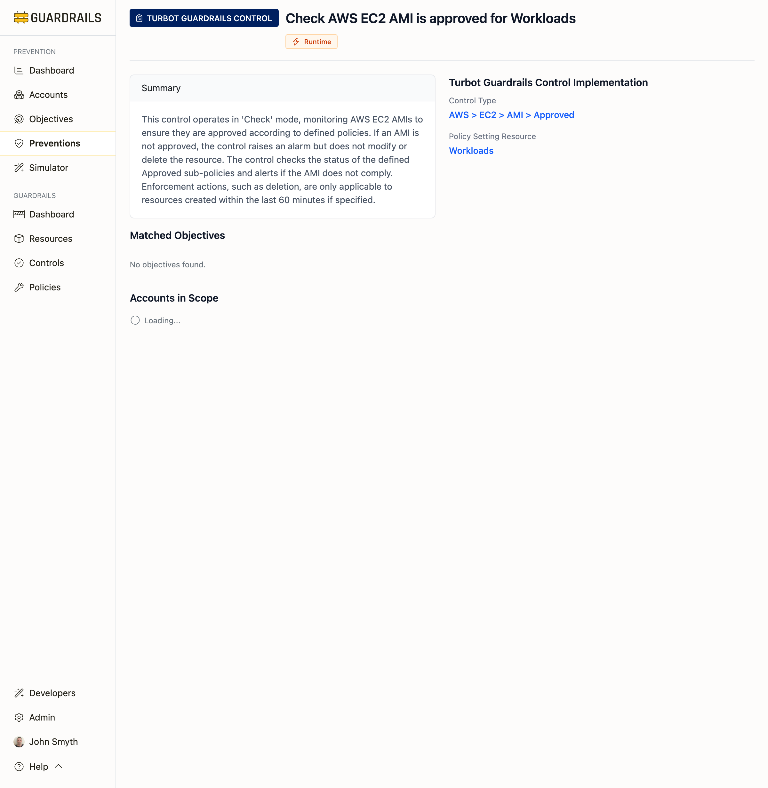

# Preventions

This is your inventory of active preventions—every Service Control Policy, Azure Policy, account setting, GitHub branch protection rule, and Guardrails control actually running in your environment. Unlike the objectives view that shows what you're trying to achieve, this shows the preventive mechanisms doing the actual work.

## What You're Looking At

Each card represents a live prevention. "Block Public ACLs on AWS S3 Buckets for account goliath-commbank-dev" is a specific prevention applied to a specific account. "Block Force Pushes to Branches" is a GitHub branch protection rule active on your repositories. These aren't aspirational—these are real preventions Guardrails has discovered in your cloud accounts.

The layer badge (Build, Access, Config, or Runtime) tells you when the prevention operates. The type tells you the technical implementation—an AWS SCP, an Azure Policy, a GitHub ruleset, or an account-level setting. The scope shows where it applies—maybe organization-wide, maybe just one account, maybe a specific set of resources.

## Finding Specific Preventions

Search is the fastest way to navigate when you have dozens or hundreds of preventions. Search for "S3" to see all S3-related preventions. Search for an account name to see everything protecting that account. Search for "public" to find all preventions preventing public access.

Filtering becomes useful when you want to see preventions of a specific type or layer. Filter to "AWS S3 Account Setting" to see just those simple account-level toggles. Filter to "Access" layer to see all your SCPs and deny policies. Filter to a specific account when auditing that account's protection.

## Understanding Scope

Scope matters because it tells you how broadly a prevention applies. An SCP attached at your AWS Organization root applies to every account—that's organization-wide scope. An S3 Block Public Access setting on one specific account only protects that account—that's account-specific scope.

When you're evaluating coverage, organization-wide preventions give you complete protection instantly. Account-specific preventions might need to be replicated to new accounts as they're created. The scope information helps you understand whether a prevention scales automatically or requires ongoing management.

## Common Use Cases

- **When investigating why something was blocked** - Search for the service or resource type. If a developer's S3 bucket creation was denied, search for "S3" and review which preventions might have blocked it—maybe an SCP restricting regions, or an account setting blocking public ACLs.

- **When planning to implement a new prevention** - Search for similar existing preventions first. If you want to add RDS encryption requirements, search for "encryption" to see how you've implemented similar preventions for other services. This consistency makes your security architecture easier to understand and maintain.

- **When onboarding a new account** - Filter to organization-wide preventions to see what protections automatically apply. Then compare against your target state to identify which account-specific preventions need to be replicated.

## Prevention Detail View

Clicking any prevention opens the Prevention Detail page, which provides comprehensive information about that single prevention—showing what it does, which objectives it achieves, what accounts it applies to, and the specific configuration details.

The Prevention Detail page shows:

**Summary Section** - Provides a clear explanation of what the prevention does, the specific behavior being prevented or enforced, the scope of where this prevention applies, and the resource or account context. For example: "Prevents branches from being deleted to protect important code. Applies to all branches in organization-level ruleset '[Integrated Demo 2025] Branch Ruleset'."

**Matched Objectives** - Shows which prevention objectives this prevention achieves. Each objective card displays the objective title, type badge, priority level (P1-P4), and current score. This helps you understand the security value this prevention provides and which compliance requirements it satisfies.

**Configuration Details** - Displays the complete policy definition or configuration—the full JSON for SCPs, policy rules for Azure Policies, constraint configurations for GCP Organization Policies, or control settings for Guardrails controls. You can copy these directly for replication or auditing purposes.

**Scope and Coverage** - Identifies which accounts or resources are protected by this prevention. Organization-wide preventions show their complete reach across all accounts, while account-specific preventions show exactly which account they protect.

**Implementation Mechanism** - Shows the prevention type (SCP, Azure Policy, account setting, etc.) and the layer it operates at (Build, Access, Config, Runtime), helping you understand how this prevention fits into your overall defense-in-depth strategy.

### Using the Detail View

When investigating why something was blocked, open the prevention detail to see the exact configuration. The policy definition shows you precisely which actions are denied, under what conditions, and with what exceptions.

When implementing a similar prevention, use the detail view to see how existing preventions are configured. Copy the policy JSON or configuration settings and adapt them for your new use case, ensuring consistency across your security architecture.

When auditing prevention coverage, check the Matched Objectives section to understand what security goals this prevention achieves. If you're preparing for compliance audits, this helps you map preventive mechanisms to compliance requirements.

## Next Steps

- Check [Types](/guardrails/docs/prevention/preventions/types) to understand different prevention mechanisms
- Visit [Layers](/guardrails/docs/prevention/preventions/layers) to assess defense-in-depth coverage
- See [Objectives](/guardrails/docs/prevention/objectives) to understand which security goals these preventions achieve
- Review [Recommendations](/guardrails/docs/prevention/objectives/recommendations) for implementation guidance
