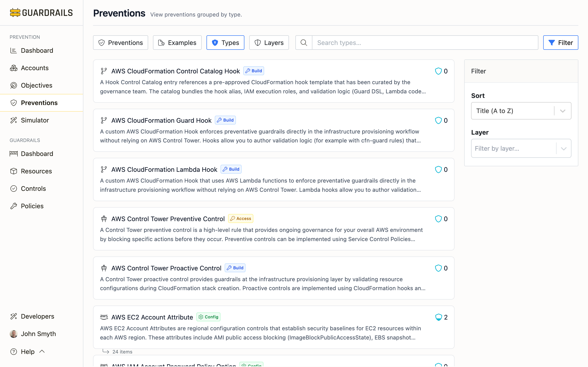

# Prevention Types

Prevention types describe how preventions are technically implemented—Service Control Policies, Azure Policies, account settings, GitHub rulesets, and so on. Each prevention type has different characteristics, tradeoffs, and appropriate use cases. Understanding these helps you choose the right tool for each security objective.

## Why Prevention Types Matter

You could achieve "require encryption for S3 buckets" through an SCP that denies unencrypted uploads, an S3 Bucket Key setting enforcing encryption, or a Guardrails control that remediates non-encrypted buckets. All three accomplish the same objective, but they work differently and have different tradeoffs in complexity, flexibility, and operational characteristics.

The Types view helps you understand your current approach and identify opportunities to simplify or standardize. If you're implementing similar controls across services using inconsistent mechanisms, standardizing makes your security architecture easier to understand and maintain.

## Common Prevention Types

The specific prevention types available depend on which Turbot mods are installed. Below are common types organized by the layer where they typically operate.

### Build Layer Types

**AWS CloudFormation Guard Hook** - Custom CloudFormation hooks that enforce preventative guardrails during infrastructure provisioning using Guard DSL validation logic. Hooks evaluate templates at preCreate and preUpdate phases and block non-compliant resources before they are created. Note that hooks only evaluate deployments originating from CloudFormation (including SAM/CDK), not resources created via console, SDKs, or other IaC tools.

**AWS CloudFormation Lambda Hook** - Custom CloudFormation hooks using Lambda functions for validation logic, providing maximum flexibility for complex validation, external system integration, and custom business rules that cannot be expressed in Guard DSL. Like Guard hooks, these only evaluate CloudFormation deployments.

**AWS CloudFormation Control Catalog Hook** - References pre-approved CloudFormation hook templates curated by the governance team. The catalog bundles the hook alias, IAM execution roles, and validation logic into reusable artifacts deployed through CloudFormation.

**AWS Control Tower Proactive Control** - Validates resource configurations during CloudFormation stack creation using CloudFormation hooks. Proactive controls prevent non-compliant resources from being deployed and only affect resources deployed through CloudFormation.

### Access Layer Types

**AWS SCP Deny Statement** - Service Control Policy deny rules that explicitly block specific actions across accounts within an AWS Organization. Deny statements create hard barriers by overriding any Allow permissions granted through IAM policies. These apply to all identities within affected accounts, including the account root user, making them powerful for enforcing security baselines like blocking security resource deletion, restricting regions, or preventing security service disablement.

**AWS SCP Allow Boundary** - Represents the union of all Allow statements from SCPs attached to an Organization Root, OU, or Account. The allow boundary defines what actions are permitted at that specific level before considering the intersection across the organizational hierarchy, providing visibility into permissions granted at each organizational level.

**AWS RCP Deny Statement** - Resource Control Policies provide resource-level denials to protect specific resources from any principal, including external accounts. RCPs offer more granular control than SCPs by denying actions on specific resources (like S3 buckets or KMS keys) rather than broad service-level restrictions.

**AWS Control Tower Preventive Control** - High-level rules providing ongoing governance by blocking specific actions before they occur. Can be implemented using SCPs, RCPs, or CloudFormation hooks. These controls create hard barriers affecting entire OUs and every account within the OU.

### Config Layer Types

**AWS S3 Account Setting** - Account-level configuration controls establishing security baselines for all S3 buckets within an AWS account. Include S3 Account Public Access Block configurations (BlockPublicAcls, IgnorePublicAcls, BlockPublicPolicy, RestrictPublicBuckets) that prevent public access at the account level, operating uniformly across all regions and buckets.

**AWS EC2 Account Attribute** - Regional configuration controls establishing security baselines for EC2 resources within each region. Include AMI public access blocking, EBS snapshot public access blocking, default EBS encryption, and internet gateway block mode. Configured per-region but aggregated at account level for unified security posture view.

**AWS IAM Account Password Policy Option** - Account-level configuration controls establishing password policy and authentication requirements for all IAM users. Include password complexity requirements, password rotation policies, and password reuse prevention, operating uniformly across the entire account.

### Runtime Layer Types

**Turbot Guardrails Control** - Provides continuous compliance monitoring and automated remediation for cloud resources across multi-cloud environments. Controls detect configuration drift and non-compliant resources with different enforcement levels: Check (detect and alert), Enforce (automatically remediate), and Skip (disable). Can monitor and enforce settings at multiple levels including account, region, resource type, and individual resources.

## Prevention in Depth

Defense-in-depth means implementing multiple prevention types at different layers so if one fails or has gaps, others provide backup protection. For critical objectives, relying on a single prevention type leaves you vulnerable if that prevention has an exception, misconfiguration, or bypass.

Consider an objective like "prohibit public S3 buckets." You might implement:
- AWS SCP Deny Statement denying public bucket policies (Access layer) - blocks API calls organization-wide
- AWS S3 Account Setting for Block Public Access (Config layer) - enforces settings regardless of bucket policies
- Turbot Guardrails Control for remediation (Runtime layer) - continuously detects and fixes any buckets that become public

If the SCP Deny Statement has an exception for a specific OU, the S3 Account Settings still protect those accounts. If someone disables the account setting, the Guardrails Control remediates it. Multiple prevention types at multiple layers create redundancy that significantly reduces risk.

Different prevention types naturally operate at different layers. AWS SCP Deny Statements and AWS RCP Deny Statements operate at the Access layer. AWS S3 Account Settings and AWS EC2 Account Attributes operate at the Config layer. Turbot Guardrails Controls operate at the Runtime layer. This natural alignment makes it easier to build defense-in-depth—implement the objective using prevention types from different layers.

## Next Steps

- Return to [Preventions](/guardrails/docs/prevention/preventions/preventions) to see all your controls regardless of prevention type
- Check [Layers](/guardrails/docs/prevention/preventions/layers) to understand when each prevention type typically operates
- Visit [Objectives](/guardrails/docs/prevention/objectives) to see which objectives each prevention type helps achieve
- Review [Recommendations](/guardrails/docs/prevention/objectives/recommendations) for implementation guidance
