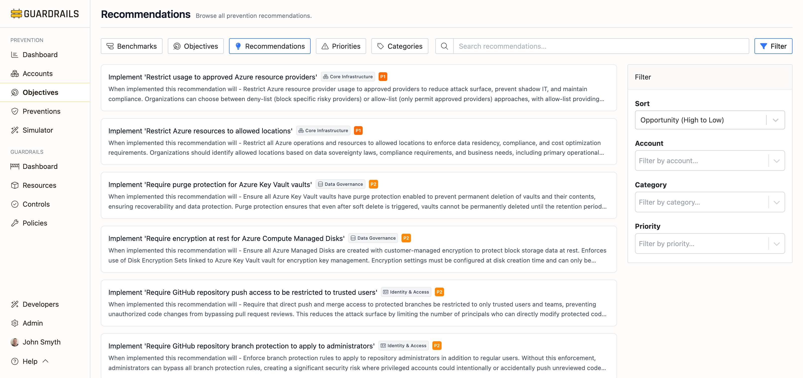

# Recommendations

The Recommendations page provides prioritized, actionable guidance for implementing preventions across your cloud environment. This page helps you identify which preventions to implement first based on security impact, compliance requirements, and implementation effort.



## Understanding Recommendations

Recommendations are specific, actionable preventions you should implement to improve your security posture. Each recommendation:
- Achieves one or more prevention objectives
- Has a clear priority level (P1, P2, P3, P4)
- Includes implementation guidance
- Shows the expected security impact
- Belongs to a security category

Unlike the Objectives or Preventions pages which show what's possible, the Recommendations page focuses on what you should do next based on your current environment and gaps.

## Page Layout

The Recommendations page displays:

### Header Section

- **Page title**: "Recommendations - Browse all prevention recommendations"
- **Navigation tabs**: Benchmarks, Objectives, Recommendations, Priorities, Categories
- **Search box**: Find recommendations by keyword
- **Filter button**: Filter by account, category, or priority
- **Sort dropdown**: Order by opportunity (high to low), priority, title, or category

### Recommendation Cards

Each recommendation card shows:
- **Title**: "Implement '[Specific Prevention Name]'"
- **Category badge**: The security domain (Core Infrastructure, Data Governance, Identity & Access, etc.)
- **Priority badge**: P1 (critical), P2 (high), P3 (medium), or P4 (low)
- **Impact description**: "When implemented this recommendation will -" followed by the expected security improvement

**Example recommendation:**
```
Implement 'Restrict usage to approved Azure resource providers'
Category: Core Infrastructure
Priority: P1

When implemented this recommendation will - Restrict Azure resource provider usage
to approved providers to reduce attack surface, prevent shadow IT, and maintain
compliance. Organizations can choose between deny-list (block specific risky
providers) or allow-list (only permit approved providers) approaches, with
allow-list providing stronger security but requiring more planning.
```

## Search and Filter

**Search functionality:**
Use the search box to find recommendations by:
- Prevention name (e.g., "encryption", "MFA", "S3")
- Service or resource type (e.g., "Azure Storage", "GitHub", "Lambda")
- Compliance framework (e.g., "CIS", "NIST")
- Security control type

**Filter options:**
Click the Filter button to narrow the list:
- **By Account**: Show only recommendations for specific accounts or subscriptions
- **By Category**: Filter by security domain (Identity & Access, Data Governance, etc.)
- **By Priority**: Focus on P1 (critical) or P2 (high) recommendations

**Sort options:**
Order recommendations by:
- **Opportunity (High to Low)**: Default view showing highest-impact recommendations first
- **Priority**: Group by P1, P2, P3, P4
- **Title (A to Z)**: Alphabetical order
- **Category**: Group by security domain

## Recommendation Priorities

Recommendations are prioritized based on multiple factors:

**P1 (Critical)**
Most fundamental preventative controls that should be implemented immediately. These typically:
- Address critical security risks
- Are required by compliance frameworks
- Have broad security impact across the environment
- Protect against common, high-severity threats

**Examples:**
- Restrict usage to approved Azure resource providers
- Restrict Azure resources to allowed locations
- Require MFA for AWS root user authentication

**P2 (High)**
Important preventions that provide strong security improvements. These typically:
- Protect sensitive data or critical resources
- Prevent common attack vectors
- Are recommended by compliance frameworks
- Have moderate implementation complexity

**Examples:**
- Require encryption at rest for Azure Compute Managed Disks
- Require GitHub repository secret scanning push protection
- Prohibit public AWS Lambda resource policies
- Enforce HTTPS-only listeners for AWS Elastic Load Balancers

**P3 (Medium)**
Additional preventions that enhance security posture. These typically:
- Provide defense-in-depth
- Support compliance requirements
- Improve operational security
- May have higher implementation complexity

**Examples:**
- Require soft delete for Azure File Shares
- Require private endpoints for Azure Storage storage accounts
- Require Microsoft Defender for various Azure services

**P4 (Low)**
Optional preventions for comprehensive coverage that provide incremental security improvements with lower overall impact.

## Recommendation Categories

Recommendations are organized by security domain:

**Core Infrastructure**
Controls that protect foundational infrastructure and control plane resources. Includes restricting resource providers, controlling resource locations, and protecting infrastructure management.

**Data Governance**
Controls related to data protection, encryption, residency, and lifecycle management. Includes encryption at rest and in transit, data retention, and secure data handling.

**Identity & Access**
Controls that restrict privileged access and enforce strong authentication. Includes MFA enforcement, credential management, and permission controls.

**Trust & Sharing**
Controls that prevent external or anonymous access based on identity boundaries. Includes blocking public access and controlling cross-account sharing.

**Network Perimeter**
Controls that restrict network connectivity and traffic patterns. Includes enforcing HTTPS, private endpoints, and network access restrictions.

**Audit & Logging**
Controls that protect audit trails and logging infrastructure. Includes ensuring logs are collected, retained, and protected from tampering.

**Feature Restrictions**
Controls that disable or restrict specific service features that pose security risks. Includes limiting remote access and restricting risky service capabilities.

## Understanding "Opportunity"

The default sort order is "Opportunity (High to Low)" which prioritizes recommendations based on:

**Security impact**
How significantly the prevention reduces risk across your environment. Higher-impact preventions protect more resources or prevent more severe threats.

**Coverage gaps**
How many accounts or resources lack this prevention. Recommendations that would protect many currently unprotected resources score higher.

**Compliance requirements**
Whether the prevention is required by compliance frameworks you're pursuing (CIS, NIST, etc.).

**Implementation feasibility**
Preventions that are easier to implement may score higher when they provide similar security value to more complex alternatives.

This scoring helps you focus on recommendations that provide the most security value for your investment.

## Common Workflows

**Starting a new prevention initiative**
1. Review the recommendations list in default sort order (Opportunity: High to Low)
2. Focus on P1 recommendations first
3. Click on each recommendation to understand:
   - What objective it achieves
   - Which accounts need it implemented
   - How to implement it (policy examples, configuration steps)
4. Create an implementation plan prioritizing high-opportunity P1 and P2 recommendations
5. Track progress by monitoring how recommendations move from "recommended" to "active"

**Meeting compliance requirements**
1. Use the search box to find recommendations related to your target framework
   - Search for "CIS", "NIST", "PCI", etc.
2. Filter by priority to focus on P1 and P2 recommendations
3. Review which compliance objectives each recommendation satisfies
4. Implement recommendations systematically by benchmark section
5. Use the Benchmarks view to track overall compliance progress

**Securing a specific account or subscription**
1. Click the Filter button
2. Select the specific account from the Account filter
3. Review all recommendations for that account
4. Sort by Priority to focus on critical gaps first
5. Implement P1 recommendations before moving to P2
6. Return to the account detail page to verify improved prevention score

**Addressing a specific security domain**
1. Click the Filter button
2. Select a category (e.g., "Data Governance", "Identity & Access")
3. Review all recommendations in that domain
4. Identify patterns (e.g., many encryption-related gaps)
5. Create category-specific remediation plans
6. Implement preventions systematically across the category

**Planning monthly security improvements**
1. Set a goal for number of recommendations to implement per month
2. Focus on highest-opportunity recommendations each month
3. Balance across categories to maintain broad security coverage
4. Track progress by monitoring:
   - Reduction in total recommendations
   - Improvement in prevention scores
   - Increase in benchmark compliance scores
5. Adjust monthly goals based on team capacity and complexity

**Understanding a specific recommendation**
1. Click on the recommendation card to view its detail page
2. Review which objective it achieves
3. Check the Examples tab for policy templates
4. Read implementation guidance in the Recommendations section
5. View which accounts currently lack this prevention
6. Copy policy templates and adapt for your environment

## Recommendation Impact Statements

Each recommendation begins with "When implemented this recommendation will -" followed by a clear statement of the security improvement. These impact statements explain:

**What will be prevented or enforced**
The specific behavior change or control that will be implemented.

**Why it matters**
The security risk being mitigated or compliance requirement being met.

**How it protects your environment**
The attack vectors blocked or security capabilities enabled.

**Example impact statement:**
"When implemented this recommendation will - Prevent Lambda functions from being invoked by unauthorized principals to prevent unauthorized invocation and data exfiltration. This is critical because public Lambda resource policies can enable unauthorized access, data exfiltration, and abuse of computational resources."

## Tracking Implementation Progress

As you implement recommendations:

**Recommendations decrease**
When you implement a prevention that achieves an objective across all applicable accounts, that recommendation disappears from the list.

**Scores improve**
Account prevention scores, objective scores, and benchmark scores increase as recommendations are implemented.

**New recommendations may appear**
As you add new accounts or enable new services, new recommendations may be generated.

**Priority may change**
As your environment evolves, the opportunity scoring may change, re-prioritizing which recommendations provide the most value.

## Best Practices

**Start with P1 recommendations**
Critical preventions provide the most security value and are often prerequisites for P2 and P3 controls.

**Implement preventions layer by layer**
For each objective, implement preventions at multiple layers (Build, Access, Config, Runtime) for defense-in-depth.

**Focus on one category at a time**
Implementing all Data Governance recommendations together often requires similar expertise and tooling, making it more efficient than jumping between categories.

**Use policy templates**
The Examples tab provides ready-to-use policy templates (SCPs, Azure Policies, etc.) that accelerate implementation.

**Test before deploying broadly**
Start with a test account, verify the prevention works as expected, then roll out to production accounts.

**Document exceptions**
If you choose not to implement a recommendation, document why (e.g., conflicts with business requirements, alternative control in place).

**Automate deployment**
Use Infrastructure-as-Code (Terraform, ARM templates, CloudFormation) to deploy preventions consistently across accounts.

**Monitor continuously**
Return to the Recommendations page regularly to address new recommendations as your environment evolves.

## Next Steps

- Click into any recommendation to see detailed implementation guidance
- Visit [Objectives](../objectives/index.md) to understand the security goals behind recommendations
- Check [Preventions](../preventions/index.md) to see all active prevention controls
- Review [Accounts](../accounts/index.md) to see prevention coverage by account
- Use the [Simulator](../simulator/index.md) to test Service Control Policies before deployment
