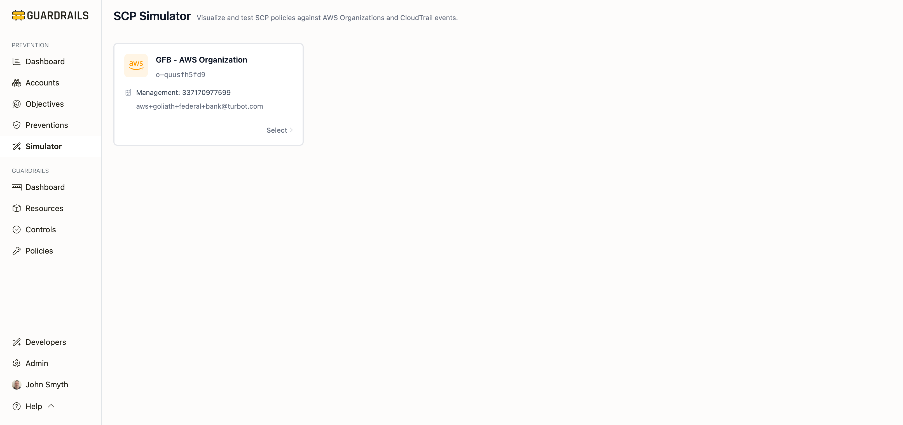

# SCP Simulator

The SCP Simulator lets you test Service Control Policies before deploying them to production. Service Control Policies are powerful—they can deny API actions across your entire AWS Organization—but that power makes them risky to deploy without testing. The simulator helps you understand how an SCP will affect your environment, catch unintended consequences, and validate that policies work as expected.

## Why Testing SCPs Matters

Service Control Policies are unusual among AWS controls because they're so broad and so permanent. An SCP attached at your organization root affects every account, every principal, every API call. An SCP deny can't be overridden by an IAM allow—it's absolute. If you deploy an SCP that accidentally denies a critical operation, you've just broken that operation across your entire organization.

The simulator prevents these mistakes. You can paste an SCP, test it against recent CloudTrail events from your accounts, see what would be blocked, refine the policy, and test again—all without touching production. By the time you deploy, you're confident the SCP does what you intend and nothing more.

## How to Use It

Start by selecting your AWS Organization from the available organizations imported into Guardrails. Each organization shows its management account details so you can confirm you're testing against the right environment.

Once you've selected an organization, you have several testing options. You can paste an SCP policy document to validate its syntax and see what it would block. You can test against CloudTrail events—either upload CloudTrail logs or specify individual API calls—to see if they'd be allowed or denied. You can visualize how the policy would apply across your organization hierarchy, seeing which accounts and OUs would be affected.

The simulator shows you exactly what would happen: which actions would be allowed, which would be denied, and which policy in the hierarchy caused each deny. This is particularly valuable when multiple SCPs apply to an account (from the organization root, from OUs, and from the account itself), because understanding the combined effect can be challenging.

## Common Use Cases

The most common use case is testing a new SCP before deployment. You draft a policy meant to block dangerous actions or enforce regional restrictions, paste it into the simulator, test it against recent CloudTrail events from accounts that will be affected, and see what would be blocked. If the simulator shows you're about to deny legitimate CloudFormation deployments or CI/CD operations, you refine the policy to add exceptions before any damage is done.

Another valuable use case is diagnosing why something's being blocked. If developers report that an API call is being denied and you suspect an SCP is responsible, you can recreate the API call in the simulator and see exactly which SCP policy is causing the deny. This helps you understand if the block is intentional (working as designed) or if the policy needs adjustment.

The simulator is also useful for training. SCPs are conceptually different from IAM policies—they only restrict, they inherit down the organization tree, explicit denies can't be overridden—and the simulator provides a safe environment to demonstrate these behaviors and let team members experiment.

## Understanding SCP Behavior

SCPs inherit down the organization tree. If you attach an SCP at the organization root, it affects every account. If you attach an SCP to an OU, it affects that OU and all accounts and child OUs beneath it. If any SCP in the hierarchy denies an action, the action is denied—there's no way to override an explicit deny.

The effective permissions for any API call are the intersection of all SCPs in the hierarchy and the IAM policies. Even if IAM policies allow an action, an SCP can deny it. But SCPs don't grant permissions—they only restrict what IAM policies can grant.

Most organizations use one of two SCP patterns. The allowlist pattern explicitly allows specific services (like S3, EC2, RDS) and implicitly denies everything else—useful for restricting which AWS services can be used. The denylist pattern explicitly denies specific dangerous actions (like deleting IAM roles or stopping CloudTrail) while allowing everything else—useful for preventing specific risky operations.

The simulator helps you test both patterns and understand their effects before deployment. You can see which services would be blocked by an allowlist, or which operations would be denied by a denylist, and refine the policy until it matches your intent.

## Best Practices

Always test with real CloudTrail data from your environment. Theoretical testing is valuable, but testing against actual API calls from your workloads catches real-world issues. Export recent CloudTrail logs from accounts that will be affected by the SCP, upload them to the simulator, and verify nothing critical gets blocked.

Start conservatively. Your first SCP should be narrowly scoped—maybe just restricting regions, or just blocking one specific dangerous action. Test thoroughly. Deploy. Monitor for issues. Once you're confident in your process, you can deploy broader policies.

Store SCP policies in version control alongside your Infrastructure as Code. This provides an audit trail of changes, makes it easy to roll back if needed, and allows for code review before deployment.

Document why each SCP exists. An SCP that denies certain actions might be obvious today, but six months from now when requirements change, having a clear explanation of the intent helps determine if the policy should be modified or if the new requirement should be implemented differently.

## Limitations

The simulator currently supports only AWS Service Control Policies. Azure Policies and GCP Organization Policies have their own testing mechanisms in their respective cloud consoles. If you're using Guardrails controls, those can be tested in non-production accounts before enabling enforcement.

The simulator provides a close approximation of policy effects, but complex conditions or service-specific behaviors might differ slightly from production. Always plan for gradual rollout—deploy to a test OU first, monitor for issues, then expand to production OUs.

## Next Steps

- Return to [Preventions](/guardrails/docs/prevention/preventions) to see which SCPs are currently deployed
- Check [Examples](/guardrails/docs/prevention/preventions/examples) for tested SCP templates you can adapt
- Review [Objectives](/guardrails/docs/prevention/objectives) to understand which security goals SCPs can achieve
- Visit [Recommendations](/guardrails/docs/prevention/recommendations) to find SCP policies recommended for your environment
